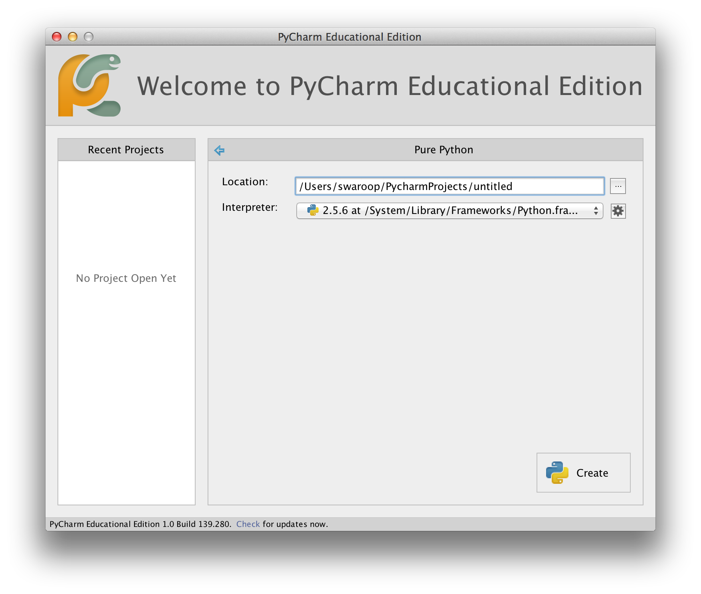
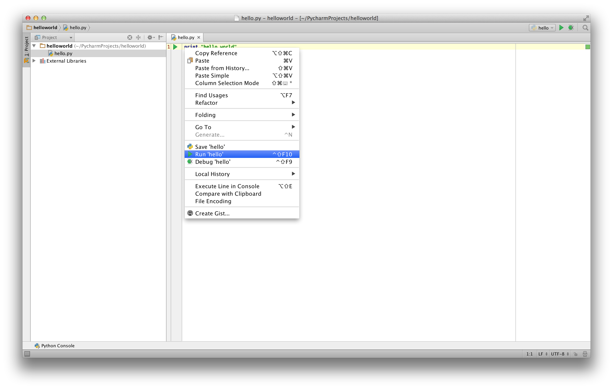

<div dir=rtl>

# گام اولیه


حالا وقتش رسیده که برنامه سنتی 'Hello World' را در پایتون اجرا کنیم. این به شما نوشتن، ذخیره کردن و اجرای برنامه‌ی پایتون را یاد می‌دهد.


دو روش برای اجرای برنامه‌ی شما در پایتون موجود است. با استفاده از مترجم تعاملی و یا با استفاده منبع فایل می‌توانیم این کار را انجام دهیم. حال، چگونگی استفاده از هر دو روش را خواهیم دید.


## استفاده از شل تعاملی

ترمینال خود را در سیستم عامل خود باز کنید(همانطور که قبلا در فصل [نصاب](./installation.md#installation) ) اشاره شد.
 بعد برنامه‌ی پایتون را باز کنید. با نوشتن `Python3`  دکمه‌[enter]` کیبورد را فشار دهید. 

پس از انکه پایتون را اجرا کردید شما همچین سمبلی  `>>>`  را مشاهده خواهید کرد.جاییکه شما می‌توانید مسائل خود را تایپ کنید. به این _مترجم تعاملی پایتون_ (_Python interpreter prompt_) می‌گویند.

در مترجم فوری:

<div dir=ltr>


```python
print("Hello World")
```

<div dir=rtl>


بعد از فشار دادن کلید  `[enter]` کیبورد، شما باید جمله‌ی `Hello World` را چاپ شده برروی صفحه نمایش خود ببینید.

در اینجا یک مثالی از کامپیوتر مکینتاش خواهید دید. جزئیات درباره‌ی برنامه‌های پایتون ممکن است در کامپیوترهای شما متفاوت باشند. اما (بعد از این سمبل `>>>`) باید یکی باشد اگرچه سیستم عامل‌ها متفاوت باشند.

<div dir=ltr>

```python
> python3
Python 3.5.1 (default, Jan 14 2016, 06:54:11)
[GCC 4.2.1 Compatible Apple LLVM 7.0.2 (clang-700.1.81)] on darwin
Type "help", "copyright", "credits" or "license" for more information.
>>> print("Hello World")
Hello World
```

<div dir=rtl>

توجه داشته باشید که، پایتون سریعا جواب یا خروجی را می‌دهد. چیزی که همین الان نوشتید این یک  _دستور_ پایتون است. ما برای چاپ هر مقداری از `print` (جایی برای تعب نیست) استفاده می‌کنیم. در اینجا ما از متن `Hello World` استفاده کردیم. که سریعا برروی صفحه‌ی نمایش نشان داده می‌شود.

### چگونگی خارج شدن از شل 

اگر شما از گنو لینوکس با مک استفاده می‌کنید برای خارج شدن کافی است از کلید  `[ctrl + d]` یا نوشتن  `exit()` (پراتنز  `()` را به یاد داشته باشید ) و برروی دکمه‌ی `[enter]` کیبورد فشار دهید، می‌توان این کار را انجام دهید.

اگر هم از خط فرمان ویندوز استفاده می‌کنید با استفاده از کلید`[ctrl + z]` و بعد برروی دکمه‌ی `[enter]` کیبور فشار دهید، می‌توان این کار را انجام دهید.


## انتخاب ویرایشگر

ما نمی‌توانیم هر سری برنامه‌ی خود را در شل پایتون وارد کنیم. هر وقت می‌خواهیم برنامه‌ی را اجرا کنیم باید ان را در یک فایل ذخیره کنیم و از این به بعد هر بار که نیاز داشتیم می‌توانیم ان را اجرا کنیم.

برای ساخت فایل منبع در پایتون(منظورذخیره‌‌داشتن‌فایل‌است)، ما نیاز به نرم‌افزار ویرایشگر داریم. که بتوانیم برنامه‌نویسی کنیم و ذخیره کنیم. ویریشگر خوب زندگی شما را اسان می‌کند تا برنامه‌نویسی خود را راحتر و اسان‌تر انجام دهید. همچنین قابلیت ذخیره‌سازی داشته باشید. پس در نتیجه انتخاب ویرایشگر یک عامل موثر است. همانطور که با ری دادن ریئس جمهور انتخاب می‌کنید، باید ویرایشگر خود را نیز انتخاب کنید. ویرایشگر خوب به شما در برنامه‌نویسی پایتون کمک می‌کند، که کار شما را راحتر و سفر که در پیش دارید را با امکانات بیشتر طی کنید. همچنین جلوگیری از هر گونه خطا، امنیت‌ بیشتر و ساده نویسی می‌توانید این کار را انجام دهید.

یکی از الزامات بسیار اساسی _syntax highlighting
(هایلایت کردن خطا)_  که تمامی بخش‌های مختلف ان را می‌توانید به صورت رنگی ببینید. پس در نتیجه شما می‌توانید به راحتی برنامه خود را مجسم کنید و کارکرد اجرای ان را ببینید.

اگر شما هیچ ایده‌ای ندارید از کجا شروع کنید، من توسعه می‌کنم با استفاده از نرم‌افزار [PyCharm Educational Edition](https://www.jetbrains.com/pycharm-edu/) که برای ویندوز، گنو لینوکس و مکینتاش موجود است. جزیئیات بیشتر در بخش‌های بعدی موجود است.

اگر شما از ویندوز استفاده می‌کنید *از ویرایشگر Notepad استفاده نکیند*، این یک انتخاب اشتباه است. بخاطر انکه خطا‌ها را هایلایت (syntax highlighting) نمی‌کند و از همه مهم‌تر فاصله‌ها را رعایت نمی‌کند و این نکته خیلی مهم است که در قسمت‌های بعدی مشاهده خواهیم کرد. ویرایشگر خوب به طور خودکار این کار‌ها را انجام می‌دهد.


اگر شما برنامه‌نویس حرفه‌ای هستید فکر کنم که شما از  [ویم](http://www.vim.org) یا [ایمکس](http://www.gnu.org/software/emacs/) استفاده می‌کنید. نیاز می‌دانم که این موضوع را بگویم که این دو ویرایشگر دوتا از ویریشگر‌ها قدرتمند هستند و استفاده از انان برای برنامه‌نویسی پایتون مفید واقع خواهد شد. من خودم به شخصه از هر دو برای برنامه‌نوسی‌ استفاده می‌کنم. حتی یک اموزش برایش درست کردم. [entire book on Vim]({{ book.vimBookUrl }})

اگر شما حاضرید که وقت خود را برای یادگیری ویرایشگر  ویم یا  ایمکس بگذارید من توسعه می‌کنم یکی از این ویرایشگرها را یاد بگیرید. چون در اینده خیلی برایتون مفید واقع خواهد شد.همان طور که من قبلا گفتم کسانی که تازه شروع کرده‌اند می‌توانند از  PyCharm برای یادگیری پایتون را استفاده کنند(برای ویرایشگر در حال حاضر).

تکرار: لطفا یک ویرایشگر مناسب انتخاب کنید. این موضوع باعث می‌شود برنامه‌نویسی پایتون را سرگرم کننده و اسان‌تر کند.


<div dir=ltr>

## PyCharm {#pycharm}


<div dir=rtl>

[PyCharm Educational Edition](https://www.jetbrains.com/pycharm-edu/) این یک ویرایشگر رایگان است که شما می‌توانید برای برنامه‌نویسی پایتون استفاده کنید.

هنگامی که شما PyCharm را باز می‌کنید، شما این را خواهید دید، `Create New Project` برروی ان کلیک کنید:


`Pure Python` انتخاب کنید:


`untitled` را به  `helloworld` تغییر بدهید. همچنین محل پروژه و جزییات را باید به این شکل ببینید:




برروی کلید  `Create` کلیک کنید:

 برروی `helloworld` راست کلیک کنید. در نوار کناری  `New` -> `Python File` را انتخاب کنید:


به شما گفته می‌شود اسم را وارد کنید، `hello` را وارد کنید.


حالا شما می‌توانید فایل باز شده را ببینید:


خطوط موجود را پاک کرده و متن زیر را وارد کنید:


<!-- TODO: Update screenshots for Python 3 -->


<div dir=ltr>


```python
print("hello world")
```


<div dir=rtl>

حالا برروی متنی که نوشته‌اید راست کلیک کنید (بدون انتخاب متن) و برروی `Run 'hello'` کلیک کنید.




و حالا شما باید نتیجه‌ی برنامه خود را ببینید(چیزی که چاپ می‌کند).


اوف! ،  برای شروع به کار، این چند گام بود. ولی از این به بعد هر گاه ما از شما می‌خواهیم فایل جدید بسازید، از یاد نبرید برروی  `helloworld` راست کلیک کنید و   `New` -> `Python File` را انتخاب کنید و راه‌های قبلی که بالا اشاره شده بود را طی کنید.

شما می‌توانید اطلاعات بیشتری را درباره‌ی PyCharm در لینک  [PyCharm شروع سریع](https://www.jetbrains.com/pycharm-educational/quickstart/) مشاهده نمایید.


## ویم

<div dir=rtl>


۱. نصب [ویم](http://www.vim.org).

* کاربران مکینتاش باید از بسته‌ی `macvim` از طریق [HomeBrew](http://brew.sh/) نصب کنند.

* کاربران ویندوز باید از  [وبسایت ویم](http://www.vim.org/download.php) دانلود و نصب کنند.

* کاربران گنولینوکس باید ویم را از منبع وابستگی‌ها نصب کنند. برای دبیان و اوبونتو می‌توانند از بسته‌ی ویم  استفاده کنند.

۲. نصب پلاگین [jedi-vim](https://github.com/davidhalter/jedi-vim) برای خودکار پر کردن( autocompletion).

۳. نصب بسته مورد نیاز  `jedi` برای پایتون :

<div dir=ltr>


` pip install -U jedi`

<div dir=rtl>


## ایمکس

<div dir=rtl>

۱. نصب  [ایمکس ۲۴](http://www.gnu.org/software/emacs).

* کاربران مکینتاش باید  ایمکس از http://emacsformacosx.com دانلود کنند.

* کابران ویندوز باید ایمکس از http://ftp.gnu.org/gnu/emacs/windows/ دانلود کنند.

* کاربران گنولینوکس باید ایمکس از  منبع وابستگی‌ها نصب کنند. برای دبیان و اوبونتو می‌توانند از بسته‌ی  `ایمکس ۲۴` استفاده کنند.

۲. نصب  [ELPY](https://github.com/jorgenschaefer/elpy/wiki).


## استفاده از منبع فایل

حالا وقتش که به برنامه‌نویسی خود برگردیم. یک سنتی وجود دارد. وقتی شما زبان برنامه نویسی جدید یاد می‌گیرد، اولین برنامه‌ی را که می‌نویسید و اجرا می‌کنید این برنامه برنامه‌ی 'Hello World' است. تمام کاری که انجام می‌دهد این است که 'Hello World' را چاپ می‌کند. همانطور که Simon Cozens [^1] گفته است "این یک طلسم سنتی است که خدای برنامه نویسی نازل کرده تا بهتر برنامه‌نویسی را یاد بگریم".

از انتخاب ویرایشگر شروع کنید، برنامه‌ی بعدی را وارد کنید و ان را با نام`hello.py` ذخیره کنید.

اگر شما از PyCharm استفاده می‌کنید، ما قابلا  [درباره‌ی ذخیره سازی فایل توضیح داده‌ایم ](#pycharm).

برای دیگر ویرایشگرها یک فایل جدید`hello.py` بازکنید و برنامه‌ی زیر را وارد کنید:

<div dir=ltr> 


```python
print("hello world")
```
<div dir=rtl>

کجا باید فایل را ذخیره کرد؟ در هر پوشه‌ی که محل ان را می‌دانید. اگر شما نمی‌دانید پس یک پوشه‌ جدید ایجاد کنید و ازاین پوشه برای برنامه‌های پایتون خود، برای ذخیره‌سازی و اجرا استفاده کنید.

<div dir=ltr> 


- `/tmp/py` on Mac OS X (برای مکینتاش)
- `/tmp/py` on GNU/Linux (برای گنو لینوکس)
- `C:\\py` on Windows (برای ویندوز)

<div dir=rtl>

برای ایجاد پوشه گفته شده (البته بستگی به سیتم‌عاملی که دارید استفاده می‌کنید دارد) از دستور `mkdir` در ترمینال خود استفاده کنید. برای مثال: 

<div dir=ltr> 


`mkdir /tmp/py`

<div dir=rtl>

نکته: همیشه مطمئن شوید که افزونه‌ی فایل  `.py` را گذاشته‌اید. برای مثال: 


<div dir=ltr> 


 `foo.py`

<div dir=rtl>


 برای اجرای برنامه‌ پایتون

۱. پنجره‌ی ترمینال ویندوز را بازکنید. (فصل قبلی [نصاب](./installation.md#installation) را ببینید، در قسمت "نصب و راه‌اندازی در ویندوز").


۲. **تـــ**غيـــ**یـر** بدیــــن دایرکتوری را به جایی که فایل را ذخیره کرده‌اید. برای مثال: `cd /tmp/py`

۳.برنامه را با استفاده از دستور `python hello.py` اجرا کنید.

خروجی نمایش به این شکل است.


<div dir=ltr> 

```
$ python hello.py
hello world
```

<div dir=rtl>


اگر شما نتیجه را همان طور که بالا گفته شده گرفتید به شما تبــــريــــک! ! می‌گویم.

-شما اولین برنامه‌ی پایتون خود را اجرا کردید- شما اولین گام سخت یادگیری برنامه‌نویسی را برداشتید. که از همین اولین برنامه شروع می‌شود.


در صورت اینکه شما بــــا خـطــا مواجه شدید بالای برنامه‌ی خود _exactly_ را وارد کنید، برنامه‌ی اجرا شده شما را دوباره نشان می‌دهد.این نــکته را درنظر داشته باشید پایتون به حروف بــزرگ وکــوچیک حساس است. این کلمه `print` با ایــن  `Print` کلمه تفاوت دارد ویکسان نیست. در قسمت اول حروف `p` کــوچک است و در قسمت دوم حروف  `P`  بــزرگ است.

همچنین مطئن شوید که فاصله‌ها را رعایت کرده‌اید.  [برای چی این مهمــه](./basics.md#indentatio) در بخش‌های بعدی خواهید فهمید.


**چگونه و چطوری**

برنامه‌های پایتون از _statements(فراخوانی یا دستور)_ تشکیل شده است. در برنامه اول ما فقط یک فراخوانی هست. در این فراخوانی ما `print` را صدا می‌زنیم و متن "hello world" را به ما نمایش می‌دهد.

## گرفتن کمک 

اگر شما نیاز به کمک سریع درباره‌ی اطلاعات و توابع پایتون دارید. شما می‌توانید از تابع `help` که داخل پایتون است کمک بگیرید. این خیلی جالب و راحت درشل است.برای مثال 
`help('len')` را اجرا نمایید، این دستور سندهای مرتبط به `len`  را نمایش می‌دهد. که برای شمارش عناصر استفاده می‌شود.

توسعه: برای خارج شدن سند `q` را فشار دهید<div dir=rtl>

add this command in the text and fix left to right

پس دیگه مشخص که شما می‌توانید هر موقع که کمک خواستید در پایتون بگیرید، با استفاده از `help()` یاد بگیرد که چگونه از `help`  استفاده کنید.

اگر شما در کمک نیاز داشتید برای اوپراتورها مانند  `return` پس شما باید ان را در پرانتز بگذارید.برای مثال: ` help ('return') ` بخاطر اینکه پایتون بفهمه ما می‌خواهیم چه کنیم.


## خلاصه

حال دیگر شما می‌توانید به راحتی بنویسید،هچنین ذخیره کردن، اجرا کردن برنامه‌های پایتون را می‌دانید.

حالا که شما به عنوان برنامه‌نویس پایتون هستید، بیاید مفهوم‌های دیگر پایتون را یاد بگیریم.

---

[^1]:  نویسنده عالی کتابه 'Beginning Perl'.

